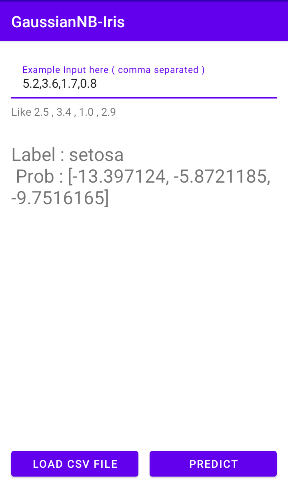

# Gaussian Naive Bayes in Android : Iris Classification Problem



This project aims to create a Gaussian Naive Bayes classifier in Android and use it on the famous [Iris dataset](https://en.wikipedia.org/wiki/Iris_flower_data_set). Gaussian Naive Bayes is a different version of commonly used Naive Bayes classifier, as it deals with numerical features.

We assume that each numerical feature in our dataset, follows a Gaussian distribution, with the mean and standard deviation calculated from that feature itself. 

The app uses [Opencsv](http://opencsv.sourceforge.net/) to parse the dataset in CSV format ( from the app's `assets` folder ).

## Use your own dataset

You may use your dataset in the app. Keep the following points in mind, so as to provide a clean dataset to the algorithm,

1. The dataset should be in the **CSV format** and should be placed in the app's `assets` folder.
2. The **first row** should contain only **names of the columns**. Like in this case of the Iris dataset, the first row contains `sepal_length,sepal_width,petal_length,petal_width,species`.
3. The **last column** in the CSV file should correspond to the **labels column**, just as we have the `species` column in the Iris dataset.
4. The **labels column** should contain all labels as **Strings only**. Like in the Iris dataset, the `species` colun contains three distinct Strings ( classes ), `setosa, versicolor, virginica`. **All other columns, except the labels column** should contain only **numerical features**. ( Just as the Iris dataset has `sepal_length,sepal_width,petal_length,petal_width` columns ). 
5. **Clean the dataset if it has null values in any of the columns**. Null/blank values in any of the columns could cause an error.

Follow the same format as the Iris dataset.

## License

```
MIT License

Copyright (c) 2021 Shubham Panchal

Permission is hereby granted, free of charge, to any person obtaining a copy
of this software and associated documentation files (the "Software"), to deal
in the Software without restriction, including without limitation the rights
to use, copy, modify, merge, publish, distribute, sublicense, and/or sell
copies of the Software, and to permit persons to whom the Software is
furnished to do so, subject to the following conditions:
The above copyright notice and this permission notice shall be included in all
copies or substantial portions of the Software.
THE SOFTWARE IS PROVIDED "AS IS", WITHOUT WARRANTY OF ANY KIND, EXPRESS OR
IMPLIED, INCLUDING BUT NOT LIMITED TO THE WARRANTIES OF MERCHANTABILITY,
FITNESS FOR A PARTICULAR PURPOSE AND NONINFRINGEMENT. IN NO EVENT SHALL THE
AUTHORS OR COPYRIGHT HOLDERS BE LIABLE FOR ANY CLAIM, DAMAGES OR OTHER
LIABILITY, WHETHER IN AN ACTION OF CONTRACT, TORT OR OTHERWISE, ARISING FROM,
OUT OF OR IN CONNECTION WITH THE SOFTWARE OR THE USE OR OTHER DEALINGS IN THE
SOFTWARE.
```
